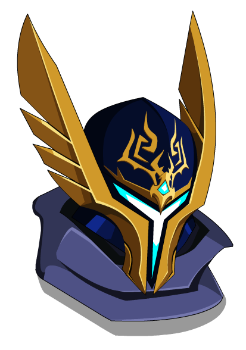
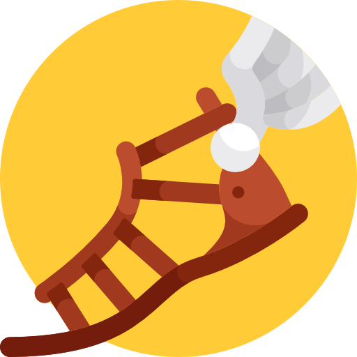
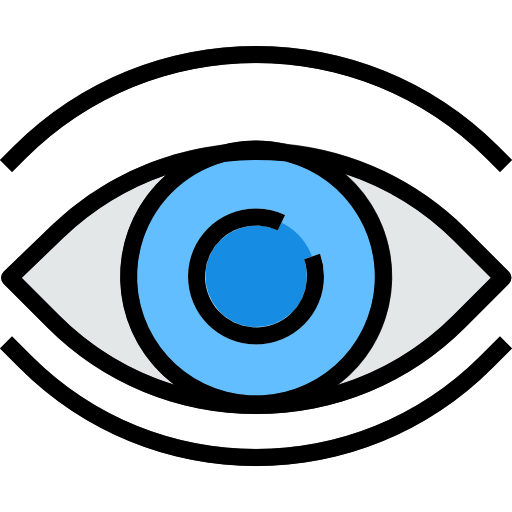

<p align="center">
  
</p>

<h3 align="center">
  A Delivery Service with monorepo event driven microservices architecture 📨
</h3>

<p align="center">
	<a href="https://lerna.js.org/">
		
	</a>
	<a href="https://github.com/guilhermebkel/stuff-delivery">
		
	</a>
	<a href="https://github.com/microsoft/TypeScript">
		
	</a>
</p>

## 📌 Overview

Stuff Delivery is a simple study of a microservice architecture using the most famous (and some new ones as well) technologies.

## 🔧 Technologies

- Kafka
- Node.js
- Kubernetes
- Docker
- React.js
- gRPC
- Kibana
- ElasticSearch
- Fluentd
- Grafana
- Redis
- Postgres
- Nginx
- AWS S3
- LocalStack

## 🛸 Microservices

We have currently 3 main microservices:

<!--  -->

### Asgardian

Responsible for making all related User business rules, per example: User Authentication, Profile Update, Authentication Token Verification and so on.

<!--  -->

### Hermes

Owns the responsability of Tracking Packages and Delivery Mans.

<!--  -->

### Iris

Controls all notification that needs to be sent, per example: Emails and Push Notifications.

## 🍭 Clients

We have currently 2 main clients:

### Delivy

Client used by users in order to track the deliveries they want to. It is built focused on the offline first approach (with a great help of RxDB)

### Admin

Client used by the people responsible for managing all the delivery system, such as error reports and track updates.

## 🌆 Architecture

### Application Structure

We have three basic ways to make communication with/between the microservices:

1. **REST:** In case someone outside needs to use a resource from some microservice. Ex: Someone tries to log in.
2. **RPC:** In case a microservice needs to use a resource from another that does not need to be processed in background. Ex: The microservice(1) needs to know if a user is authenticated, but this method is owned by microservice(2).
3. **Pub/Sub:** In case a microservice requests a resource from another that needs to be processed in background. Ex: An action ocurred and an email needs to be sent.

The **REST Requests** relies on **Nginx** since we use it as a Ingress Controller and Load Balancer. Below you can see an example:

```
A user attempts to log in
> POST /asgardian/login

The request goes first to Nginx, the path is verified and forwarded to the needed microservice
> PROXY_PASS asgardian:3040
```

The **RPC System** relies on **gRPC** in order to make fast communication between microservices. Below you can see an example:
```
A user tries to get his current list of packages being tracked
> GET /hermes/deliveries { token }

The Hermes Microservice uses Asgardian Microservice to verify if user is authenticated
> RPC Asgardian.isAuthenticated { token }
```

The **Pub/Sub System** relies on **Kafka** and every message send there comes in the format of an event. Below you can see an example:

```
A user signs up
> POST /asgardian/signup { email, password }

The Asgardian Microservice publishes a message to Kafka
> PUBLISH CustomerSignedUp { email, password }

The Iris Microservice is subscribed to CustomerSignedUp event and makes the action of sending a email to new user
> SERVICE Iris.sendWelcomeMail { email, password }
```

### Tests

All the services inside each microservice follow the TDD principles.

## 🌀 Repo Management

That's a monorepo managed by [**Lerna**](https://github.com/lerna/lerna), the microservices can be found on ```/apps``` folder. The modules shared between all of them can be found on ```/apps/shared```.

##  🌊 API Documentation

The API Documentation is powered by [**ApiDoc**](https://github.com/apidoc/apidoc).

##  🌉 Design

All the the app design was made with help of [**Figma**](https://figma.com) and [**Dribbble**](https://dribbble.com). Besides, the stylesheet can be found [**here**](https://www.figma.com/file/GP50ElrpjKNogmVpbcHYqx/Stuff-Delivery?node-id=0%3A1).

## 🚀 Getting started (Currently not available)

1. Clone this repository
2. Open the root directory and run the following command:
```sh
docker-compose up # Inits all needed resources
```
3. Install all dependencies:
```sh
npm run bootstrap # Will use lerna to install every repo dependency
```
4. Goes inside every repo inside apps folder and do the following:
	1. Duplicate .env.example
	2. Change .env.example name to .env
	3. Add the needed environmental variables
	4. Execute the command: ```npm run dev```

Now the resources will be available at:
- http://127.0.0.1/asgardian (Asgardian Microservice)
- http://127.0.0.1/hermes (Hermes Microservice)
- http://127.0.0.1/api-docs (REST API Documentation)
- http://127.0.0.1/delivy (User Client)

If you have **Insomnia** installed on your computer, you can download the API routes by clicking in the button below:

<a href="https://insomnia.rest/run/?label=Stuff%20Delivery%20API&uri=https%3A%2F%2Fgithub.com%2Fguilhermebkel%2Fstuff-delivery%2Fblob%2Fmaster%2Finsomnia.json">
	
</a>
